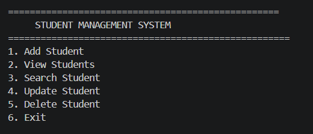
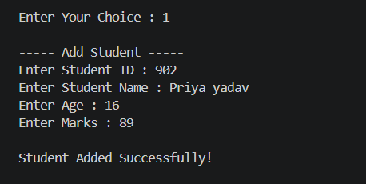
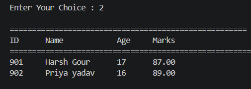

# Student Management System

A console-based Student Management System developed in C using Structures, Functions, and Binary File Handling.

## Features

- Add Student
- View Students
- Search Student
- Update Student
- Delete Student
- Binary File Handling
- Menu Driven Program
- Data Persistence
- Search by ID

## Technologies Used

- C Language
- File Handling
- Structures
- Functions

## Screenshots

### Main Menu


### Add Student


### View Students


## How to Run

Compile:

```bash
gcc main.c -o student
```

Run:

```bash
.\student
```

## Project Structure

- main.c
- README.md
- screenshots/

## Author

Harsh Gour
